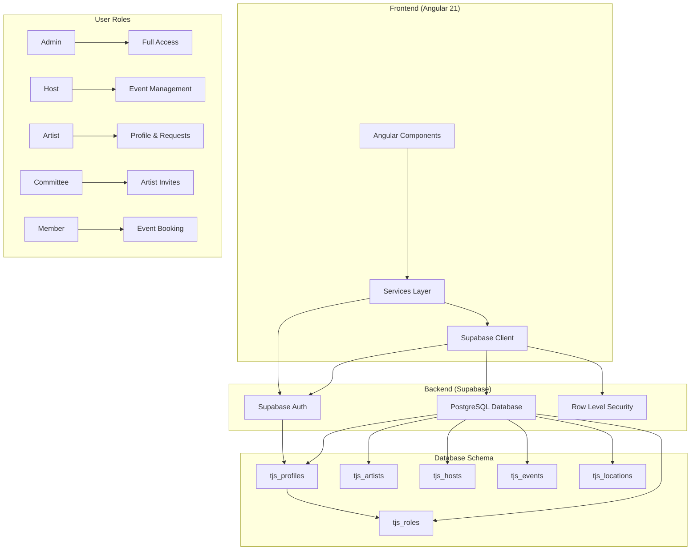

# TJS Portal - Project Architecture Overview

## Project Summary

**TJS Portal** is an Angular 21 web application for **Trempline (TJS)** - an arts/events organization that manages hosts, artists, events, members, and committee members. The platform provides role-based access control with comprehensive backoffice functionality for different user types.

## Technology Stack

| Layer | Technology | Version |
|-------|------------|---------|
| **Frontend Framework** | Angular | 21.1.4 |
| **Language** | TypeScript | 5.9.2 |
| **Styling** | Tailwind CSS + SCSS | 4.1.17 |
| **Backend** | Supabase (BaaS) | Latest |
| **Database** | PostgreSQL (via Supabase) | Latest |
| **Auth** | Supabase Auth | Latest |
| **Package Manager** | npm | Latest |

## Project Structure

```
c:/tjs/tjs-portal/
├── src/
│   ├── app/
│   │   ├── services/              # Core services
│   │   │   ├── supabase.service.ts    # Main database service (6400+ lines)
│   │   │   ├── auth.service.ts        # Authentication state management
│   │   │   └── host-management.service.ts # Host account creation
│   │   ├── guards/                # Route guards
│   │   │   └── auth.guard.ts      # Authentication & role-based guards
│   │   ├── shared/                # Shared components
│   │   │   ├── header/
│   │   │   └── footer/
│   │   ├── home/                  # Homepage
│   │   ├── about/                 # About page
│   │   ├── nous/                  # Support/donation page
│   │   ├── entreprises/           # Enterprise page
│   │   ├── admin-login/           # Admin login
│   │   ├── auth-callback/         # Supabase auth callback
│   │   ├── backoffice/            # Admin backoffice (30+ components)
│   │   │   ├── backoffice-layout/
│   │   │   ├── dashboard/
│   │   │   ├── event-requests/
│   │   │   ├── artists/
│   │   │   ├── hosts/
│   │   │   ├── my-hosts/
│   │   │   ├── events/
│   │   │   ├── user-management/
│   │   │   ├── committee-members/
│   │   │   ├── membership/
│   │   │   ├── locations/
│   │   │   └── settings/
│   │   ├── test-host-creation/    # Test component
│   │   ├── app.ts                 # Root component
│   │   ├── app.routes.ts          # Route configuration (168 lines)
│   │   └── app.config.ts          # App configuration
│   ├── environments/
│   │   ├── environment.ts         # Development config
│   │   └── environment.prod.ts    # Production config
│   ├── assets/
│   ├── styles.scss
│   ├── main.ts
│   └── index.html
├── db/                            # Database migrations
│   ├── database-schema.sql        # Main schema
│   ├── refined-schema.sql         # Enhanced schema (1039 lines)
│   ├── row-level-security.sql
│   ├── fix-rls-missing-policies.sql
│   ├── fix-invite-permissions.sql
│   ├── helper-function.sql
│   ├── seed-missing-roles.sql
│   ├── tjs_host_members.sql
│   └── user-case-event.sql
├── documents/                     # Documentation
│   ├── SUPABASE_SETUP.md
│   ├── SUPABASE_QUICK_START.md
│   ├── SERVICE_ROLE_KEY_SETUP.md
│   └── CHANGELOG_CHECKPOINTS.md
├── scripts/
│   └── set-env.js                 # Environment setup script
├── public/
│   └── favicon.ico
├── package.json
├── angular.json
├── tsconfig.json
├── tailwind.config.js
└── HOST_ACCOUNT_MANAGEMENT.md
```

## Database Schema

### Core Tables
- `tjs_roles` - Role definitions (Admin, Host, Artist, Member, etc.)
- `tjs_user_roles` - User-role junction table (many-to-many)
- `tjs_profiles` - User profiles extending auth.users
- `tjs_artists` - Artist profiles with `is_featured` flag for visibility control
- `tjs_hosts` - Host venue information
- `tjs_events` - Events organized at host venues
- `tjs_event_artists` - Event-artist junction table
- `tjs_locations` - Venue locations
- `tjs_bookings` - Member event bookings
- `tjs_requests` - Event requests from artists
- `tjs_request_artists` - Request-artist junction table
- `tjs_messages` - Contact form submissions
- `tjs_host_members` - Host-member relationships
- `tjs_host_locations` - Host-venue assignments
- `tjs_event_hosts` - Event-host assignments with status
- `sys_host_types` - Host type lookup table

### Predefined Roles
| Role | Description |
|------|-------------|
| Admin | All rights on TJS website |
| Host | Can select events, manage locations |
| Host Manager | Can manage assigned hosts |
| Host+ | Host with website integration |
| Committee Member | Can invite artists, access dashboard |
| Artist | Can update profile, propose events |
| Artist Invited | Invited artist for events |
| Member | Paid member, can book events |

## Authentication & Authorization Flow

### Auth Flow
1. Login via Supabase Auth (email/password or magic link)
2. JWT token stored in browser, auto-refreshed
3. `AuthService` loads user profile and roles on login
4. `authGuard` protects backoffice routes

### Role-Based Access
```typescript
hasRole(roleName: string): boolean {
  return this.authState$.getValue().roles.some(
    r => r.name.toLowerCase() === roleName.toLowerCase()
  );
}
```

### Post-Login Routing
- Host/Host+/Host Manager → `/backoffice/my-hosts`
- Others → `/backoffice/dashboard`

## Application Routes

The application uses a comprehensive routing structure with role-based access control:

### Public Routes
- `/` - Homepage
- `/nous-soutenir` - Support page
- `/enterprises` - Enterprise page
- `/about` - About page
- `/admin` - Admin login
- `/artist-login` - Artist login
- `/committee-login` - Committee login
- `/host-manager-login` - Host manager login
- `/host-login` - Host login

### Backoffice Routes (Protected)
- `/backoffice/dashboard` - Admin dashboard
- `/backoffice/event-requests` - Event requests management
- `/backoffice/artists` - Artist management with TJS/Invited tabs
- `/backoffice/hosts` - Host management (Admin only)
- `/backoffice/my-hosts` - Personal host management
- `/backoffice/events` - Event management
- `/backoffice/user-management` - User management (Admin only)
- `/backoffice/committee-members` - Committee member management

### Role-Specific Workspaces
- **Artist Workspace**: `/backoffice/artist-dashboard`, `/backoffice/artist-profile`, `/backoffice/artist-instruments`, etc.
- **Host Workspace**: `/backoffice/host/events`, `/backoffice/host/requests`, `/backoffice/host/locations`
- **Host Manager Workspace**: `/backoffice/host-manager`, `/backoffice/host-manager/hosts`
- **Committee Member Workspace**: `/backoffice/committee-dashboard`, `/backoffice/committee-members`

## Core Services

### 1. SupabaseService (`src/app/services/supabase.service.ts`)
Main service for all database operations with 6400+ lines of code. Key method groups:
- **Auth**: signIn, signOut, getSession, getCurrentUser, onAuthStateChange
- **Profile**: getProfile, upsertProfile, updateProfile
- **Roles**: getUserRoles, getAllRoles, assignRole, removeRole
- **User Management**: listAllUsersWithRoles, inviteUser, resendInvite, deactivateUser, reactivateUser
- **Hosts**: getHosts, createHost, updateHost, deleteHost, getMyHosts, getManagedHosts
- **Host Members**: getHostMembers, assignHostMember, removeHostMember
- **Events**: getAdminEventOverview
- **Artist Featured Flag**: toggleArtistFeatured, getArtistAuditLog

### 2. AuthService (`src/app/services/auth.service.ts`)
Manages authentication state with BehaviorSubject. Key properties:
- `state$`, `currentState`, `isAuthenticated`, `currentUser`, `currentProfile`, `currentRoles`
- `hasRole()`, `isAdmin`, `displayName`, `avatarLetter`
- `signIn()`, `signOut()`, `waitForAuthReady()`, `getPostLoginRoute()`

### 3. HostManagementService (`src/app/services/host-management.service.ts`)
Creates complete host accounts with roles, members, and venues via `createHostAccount(request)`.

## Key Features

### Artist Featured Flag Management
The `is_featured` flag on `tjs_artists` controls an artist's public visibility:
- `is_featured = false`: Visible in public directories (if also `is_tjs_artist = true` OR `is_invited_artist = true`)
- `is_featured = true`: Hidden from all public directories, listings, and search

### Audit Trail
Every flag change is logged in `tjs_artist_audit_log` with:
- `performed_by` - user who made the change
- `previous_featured` - previous state
- `new_featured` - new state
- `performed_at` - timestamp
- `reason` - optional description

### Host Account Creation
Complete host account creation with:
1. Host profile creation
2. Role assignment (Host/Host+)
3. Host manager assignment
4. Managing member setup
5. Venue assignments

## Build Configuration

### Build Commands
```bash
npm start          # Start dev server (ng serve)
npm run build      # Production build
npm run build:dev  # Development build
npm test           # Run unit tests
```

### Environment Configuration
Uses `scripts/set-env.js` to load environment variables from `.env` file:
- `NG_APP_SUPABASE_URL` - Supabase project URL
- `NG_APP_SUPABASE_KEY` - Supabase anon key
- `NG_APP_SUPABASE_SERVICE_ROLE_KEY` - Service role key (admin only)
- `NG_APP_PUBLIC_APP_URL` - Public frontend URL

### Angular Configuration
- Standalone components (Angular 17+)
- OnPush change detection recommended
- New control flow syntax (@if, @for, @switch)
- Tailwind CSS for styling

## Security

- All `tjs_` tables have RLS (Row Level Security) enabled
- Service-role key bypasses RLS (admin only)
- Never expose service-role key in production client code
- Always validate inputs before DB operations
- Check roles before sensitive operations

## Development Conventions

- **Standalone components** (Angular 17+)
- **OnPush change detection** recommended
- **Separate template/style files** (.html, .scss)
- **New control flow syntax** (@if, @for, @switch)
- **PascalCase** for components, services, interfaces
- **camelCase** for variables, methods
- **kebab-case** for file names
- **snake_case + tjs_ prefix** for database tables
- **async pipe** for observables in templates
- **switchMap** for HTTP calls in RxJS chains

## MCP Server Configuration

Supabase MCP server configured at:
`c:\Users\saura\AppData\Roaming\Code\User\globalStorage\saoudrizwan.claude-dev\settings\cline_mcp_settings.json`

Provides tools for: execute_sql, list_tables, apply_migration, search_docs, list_projects, generate_typescript_types

## Git Information

- **Remote**: `origin: https://github.com/trempline/tjs-portal.git`
- **Latest Commit**: `a9eeeedccc239098ffcfc9a2a5705020d4b8bd21`

## System Architecture Diagram



## Key Interfaces

```typescript
interface TjsProfile {
  id: string; email: string; full_name: string | null;
  phone: string | null; bio: string | null; avatar_url: string | null;
  is_member: boolean; member_since: string | null; member_until: string | null;
  is_pag_artist: boolean; created_at: string; updated_at: string;
}

interface TjsRole {
  id: string; name: string; description: string | null;
  permissions: Record<string, any>;
}

interface TjsUserWithRoles extends TjsProfile {
  roles: TjsRole[]; account_status: 'active' | 'inactive';
  invited_at: string | null; email_confirmed_at: string | null;
  last_sign_in_at: string | null;
}

interface TjsArtist {
  id: string; profile_id: string; artist_name: string;
  is_tjs_artist: boolean; is_invited_artist: boolean; is_featured: boolean;
  pag_artist_id: string | null; external_artist_id: string | null;
  availability_calendar: Record<string, any> | null;
  created_at: string; updated_at: string;
  profile?: TjsProfile | null;
}
```

## Conclusion

The TJS Portal is a well-architected Angular application with a clear separation of concerns, comprehensive role-based access control, and a robust database schema. The project leverages Supabase for backend services, providing authentication, database, and real-time capabilities. The architecture supports multiple user types with specialized workspaces and follows modern Angular development practices.